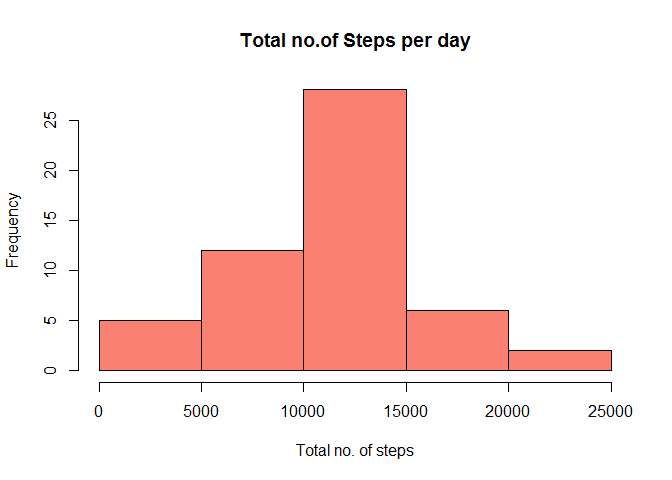
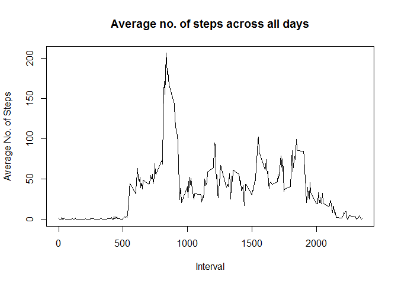
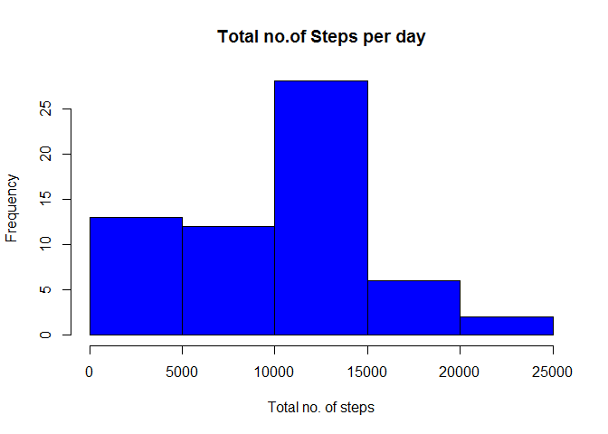
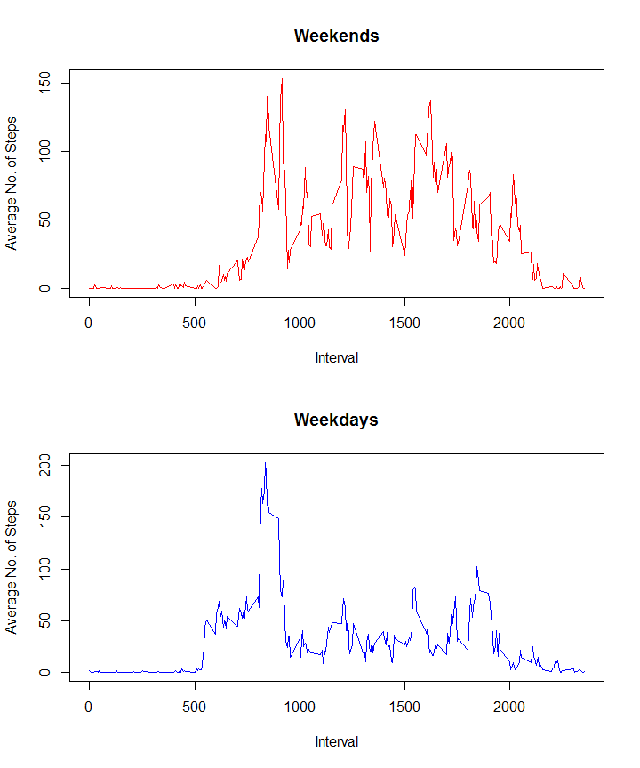

# Reproducible Research Project 1
Harikrishnan Murali  
August 16, 2015  

##Introduction

It is now possible to collect a large amount of data about personal movement using activity monitoring devices such as a Fitbit, Nike Fuelband, or Jawbone Up. These type of devices are part of the "quantified self" movement -- a group of enthusiasts who take measurements about themselves regularly to improve their health, to find patterns in their behavior, or because they are tech geeks. But these data remain under-utilized both because the raw data are hard to obtain and there is a lack of statistical methods and software for processing and interpreting the data.

This assignment makes use of data from a personal activity monitoring device. This device collects data at 5 minute intervals through out the day. The data consists of two months of data from an anonymous individual collected during the months of October and November, 2012 and include the number of steps taken in 5 minute intervals each day.

##Analysis

The file **'activity.csv'** is first extracted into the working directory and then read into R to make the necessary initial changes.


```r
data=read.csv("activity.csv")
data_new=data[complete.cases(data),]
```

###What is mean total number of steps taken per day?
Sum steps by day, create Histogram, and calculate mean and median.


```r
x=aggregate(data_new$steps,list(date=data_new$date),sum)
hist(as.numeric(x[,2]),xlab="Total no. of steps",main="Total no.of Steps per day",col="salmon")
```

 

```r
mean=mean(x[,2])
median=median(x[,2])
```

The mean for this histogram is **1.0766189\times 10^{4}** and its median is **10765**.

###What is the average daily activity pattern?
Average the no. of time steps across all days for the 5 minute intervals, and create a time series plot with the average steps and the 5 minute intervals.


```r
y=aggregate(data_new$steps,list(interval=data_new$interval),mean)
plot(y$interval,y$x,type="l",xlab="Interval",ylab="Average No. of Steps", main="Average no. of steps across all days")
```

 

```r
max=y[which.max(y$x),1]
```

The maximum no. of steps is present in the **835th** time interval.

###Imputing missing values

```r
a=complete.cases(data)
miss_val=length(a[a=="FALSE"])
```

The total no. of missing rows in the dataset are **2304**.

In this case the *NAs* in the main dataset are planned to be replaced by the average steps in each day. Hence first we create a matrix which has the average no. of steps for the corresponding dates. Since certain dates like **2012-10-01** have only *NAs* in it the matrix with the means has certain cells as *NAs*. These are first replaced by zeros. Then using this matrix of means, the new dataet is created where the *NAs* in the original dataset are replaced by the average of the no. of steps in each date.


```r
new_data=c()
new_mean=aggregate(data$steps,list(date=data$date),mean)
new_mean[is.na(new_mean)]=0
b=seq(1,length(new_mean[,1]))
for(i in b){
  d=subset(data, data$date==new_mean[i,1])
  d[is.na(d)]=new_mean[i,2]
  new_data=rbind(new_data,d)
}
head(new_data)
```

```
##   steps       date interval
## 1     0 2012-10-01        0
## 2     0 2012-10-01        5
## 3     0 2012-10-01       10
## 4     0 2012-10-01       15
## 5     0 2012-10-01       20
## 6     0 2012-10-01       25
```

```r
x_1=aggregate(new_data$steps,list(date=new_data$date),sum)
hist(as.numeric(x_1[,2]),xlab="Total no. of steps",main="Total no.of Steps per day",col="blue")
```

 

```r
mean_1=mean(x_1[,2])
median_1=median(x_1[,2])
diff_mean=mean-mean_1
diff_median=median-median_1
```

The new mean is **9354.2295082** and the new median is **1.0395\times 10^{4}**. The diffrence from the first mean is found to be **1411.959171** and the difference in median is **370**. This shows that on imputing the missing values using the stratergy declared above, the mean and the median of the histogram of the total number of steps taken each day has reduced.

###Are there differences in activity patterns between weekdays and weekends?
Split the dataset based on the dates being weekends or weekdays. Average the no. of steps across all days for the 5 minute intervals as in 2nd analysis. This is done for both the weekdays and weekend dataset, and create a time series plot.


```r
days=weekdays(as.Date(new_data[,2]))
data1=cbind(new_data,days)
data2=data1[which(data1$days %in% c("Saturday","Sunday")),]
data3=data1[!(data1$days %in% c("Saturday","Sunday")),]
x1=aggregate(data2$steps,list(interval=data2$interval),mean)
x2=aggregate(data3$steps,list(interval=data3$interval),mean)
par(mfrow=c(2,1))
plot(x1[,1],x1[,2],type="l",col="red",xlab="Interval",ylab="Average No. of Steps", main="Weekends")
plot(x2[,1],x2[,2],type="l",col="blue",xlab="Interval",ylab="Average No. of Steps", main="Weekdays")
```

 

From this we can notice that the people seem to take more steps early during weekdays compared to weekends. But on a whole they are more active during weekends than weekdays. 
